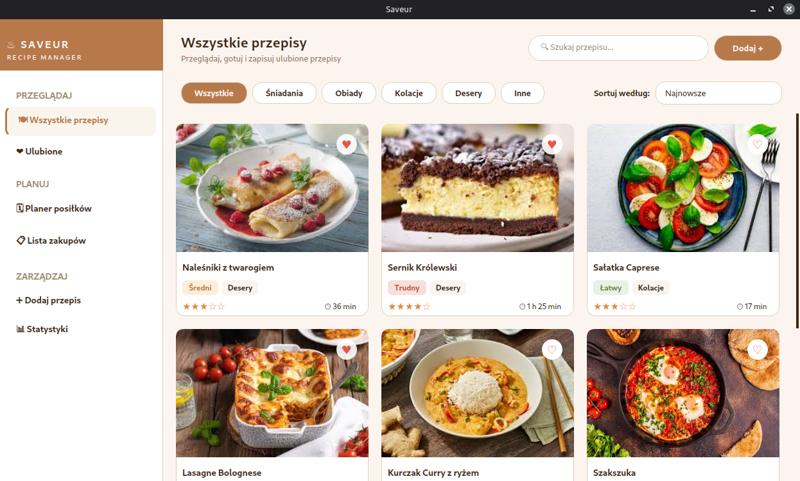
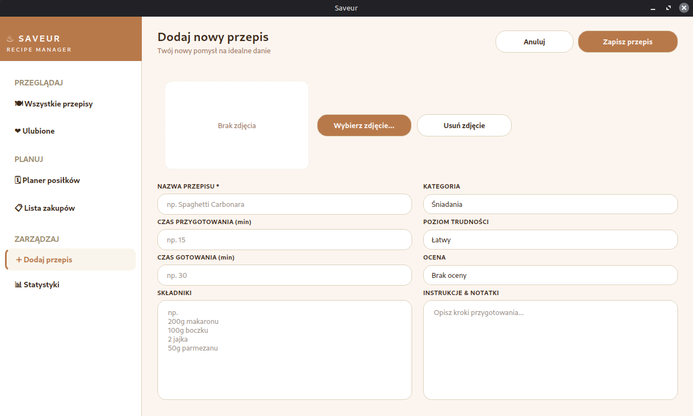
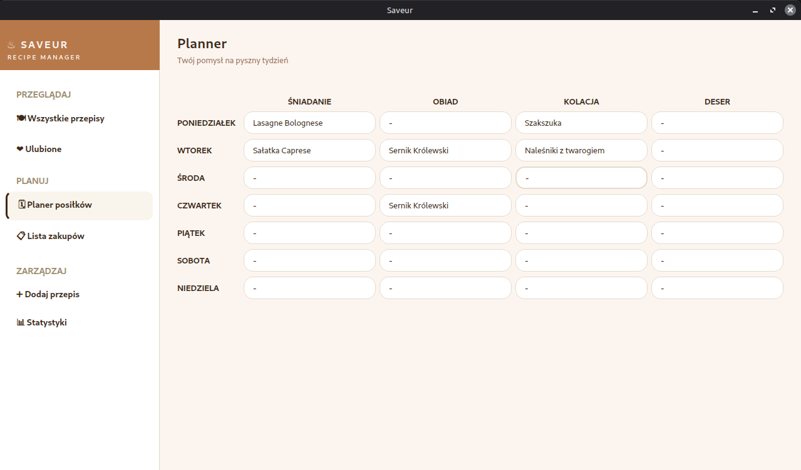
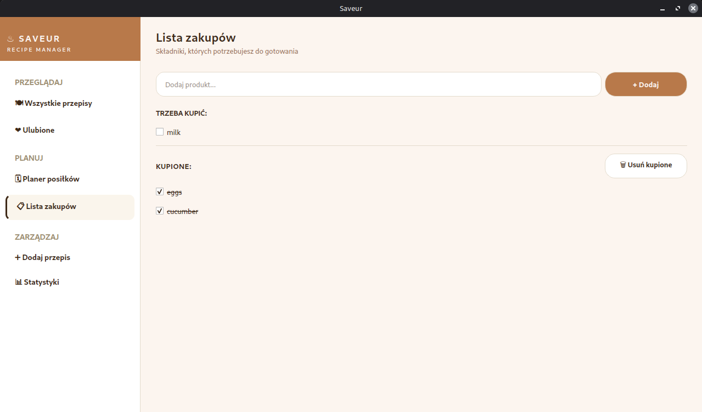
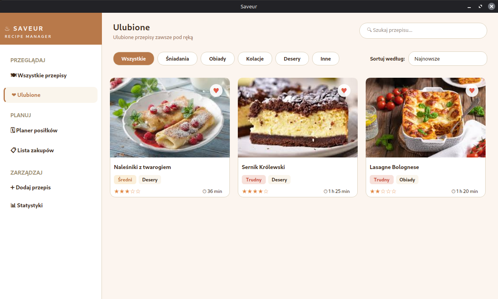
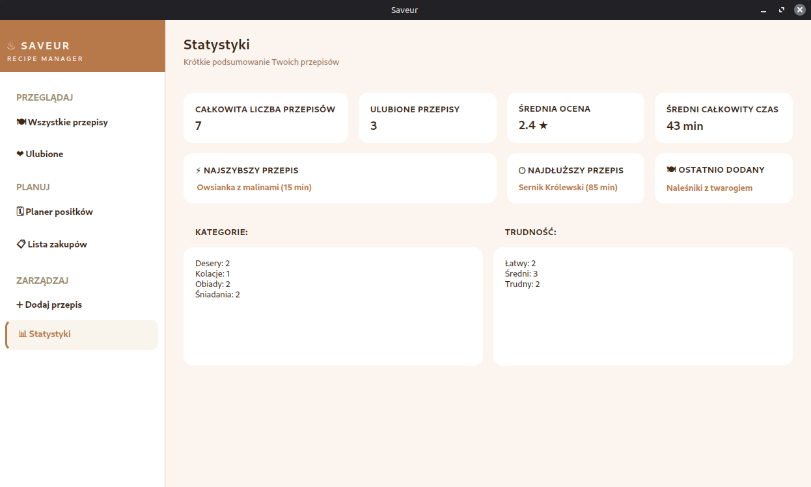
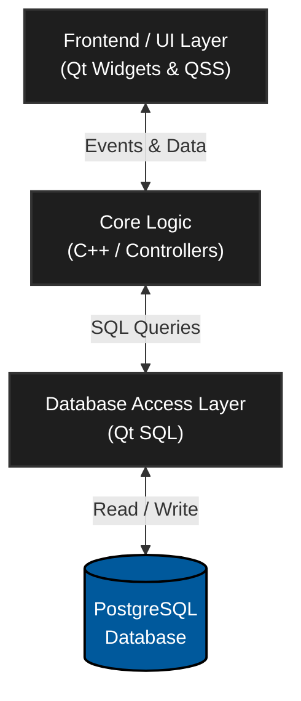

# SAVEUR - Recipe Management App


**SAVEUR** is a desktop recipe management application built with **C++**, **Qt**, and **PostgreSQL**.

It helps users organize recipes, plan meals, manage shopping items, and view useful cooking statistics in one clean interface.

---

## ✨ Features

- **Recipe CRUD**
  - Add, edit, view, and delete recipes.
  - Store recipe details such as name, category, difficulty, ingredients, notes, preparation time, cooking time, rating, and image.
  - Mark recipes as favorites.

- **Recipe Browser**
  - Browse recipes using reusable recipe cards.
  - Search recipes by name.
  - Filter recipes by category.
  - Sort recipes by date, total time, name, difficulty, and rating.

- **Meal Planner**
  - Plan meals for the whole week.
  - Assign recipes to different days and meal types.
  - Save meal plan data in PostgreSQL.

- **Shopping List**
  - Add shopping list items.
  - Mark products as bought.
  - Move completed items into a separate section.
  - Clear bought items when they are no longer needed.

- **Statistics Dashboard**
  - Display total recipes and favorite recipes.
  - Calculate average rating and average preparation/cooking time.
  - Show fastest, longest, and latest recipes.
  - Summarize recipe categories and difficulty levels.

---

## 📸 Screenshots

| Dashboard | Add Recipe |
|---|---|
|  |  |

| Meal Planner | Shopping List |
|---|---|
|  |  |

| Favorites | Statistics |
|---|---|
|  |  |

---

## 🛠 Tech Stack

- **C++**
- **Qt Widgets**
- **Qt SQL**
- **PostgreSQL**
- **CMake**
- **QSS** for custom styling
- **Qt Designer** for `.ui` layouts

---

## 🏗 Architecture

The application follows a clean, modular architecture, separating the user interface from data processing and database management.



---

## 🚀 Getting Started

Follow these steps to set up and run **SAVEUR** on your local machine.

### 📋 Prerequisites

Make sure you have the following installed:

- C++ Compiler (supporting C++11/14)
- CMake
- Qt 5 or Qt 6 (with `Widgets` and `SQL` modules)
- PostgreSQL

---

### 1️⃣ Clone the repository

```bash
git clone [https://github.com/akmqu/recipe-manager.git](https://github.com/akmqu/recipe-manager.git)
cd recipe-manager
```

---

### 2️⃣ Prepare PostgreSQL

Create a new PostgreSQL database named `recipes_db` (you can use pgAdmin or the terminal).

The application uses these default credentials to connect (you can change them in `DatabaseManager.cpp`):

| Setting  | Default value |
|----------|---------------|
| Host     | `localhost`   |
| Port     | `5432`        |
| Database | `recipes_db`  |
| User     | `postgres`    |
| Password | `123`         |

*Note: On the first launch, the application will automatically run `schemas/schema.sql` to create all necessary tables.*

---

### 3️⃣ Build the project

From the repository root folder, run:

```bash
cmake -S RecipeManager -B build
cmake --build build
```

---

### 4️⃣ Run the application

```bash
./build/RecipeManager
```
---